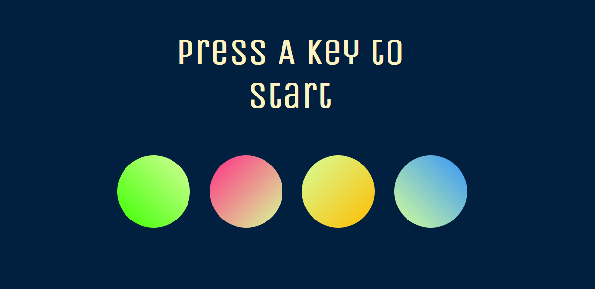

## Description
A simple Simon Says game that I used to better understand basic JavaScript & jQuery elements early in my coding journey. Both are used intermittently in this project. I also used it as an early experiment in how to format a game using CSS that would allow it to play easily on desktop and mobile.

Click the banner above to play, [or click here to play on my website](https://kbest.ca/simon-says/)!

## Lessons Learned 
Although the project was fairly simple, exchanging JavaScript and jQuery library elements caused unecessary conflict as I attempted to test both of them in a single project. It was a good learning experience as I was getting used to using jQuery for DOM manipulation, but not one that would ever bear repeating. 
